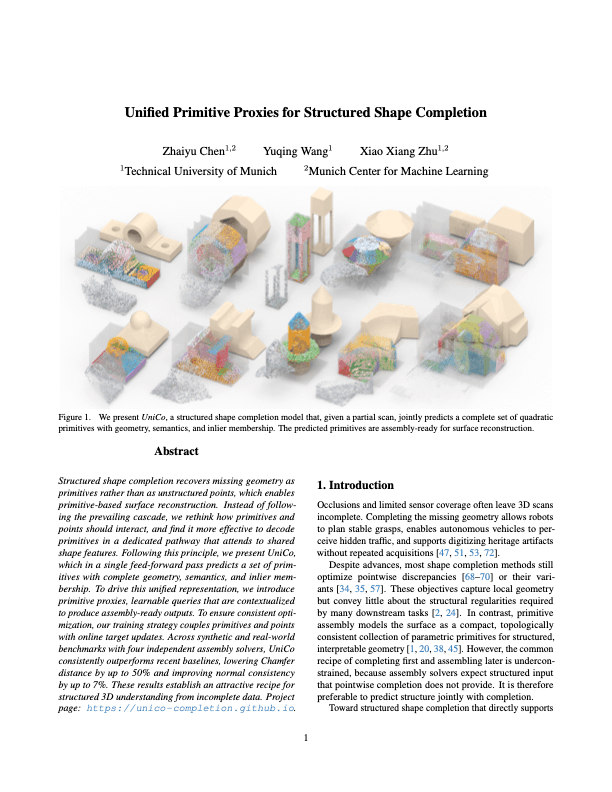

# UniCo: Unified Primitive Proxies for Structured Shape Completion

**CVPR 2026**

[](https://unico-completion.github.io)
[](https://arxiv.org/abs/2601.00759)

UniCo is a structured shape completion model that, given a partial scan, jointly predicts a complete set of quadratic primitives with geometry, semantics, and inlier membership. The predicted primitives are assembly-ready for surface reconstruction.

<p align="center">
  <a href="https://unico-completion.github.io">
    
  </a>
</p>

## ⚙️ Setup

This repository is tested with Ubuntu 22.04, Python 3.9, and PyTorch 1.12.1.

1. Clone the repository:

   ```bash
   git clone https://github.com/complete3d/unico.git && cd unico && git lfs pull
   ```

2. Create a conda environment with all dependencies:

   ```bash
   # This creates and activates the `unico` env, and builds CUDA extensions
   . install.sh
   ```


## 🏋️ Training

* Launch training with one of the helper scripts below.

  **DistributedDataParallel (DDP)**:

  ```bash
  # Replace device IDs with your own
  # Override `MASTER_PORT` to avoid collision
  CUDA_VISIBLE_DEVICES=0,1 ./scripts/train_ddp.sh experiment=abcmulti
  ```

  **DataParallel (DP)**:

  ```bash
  # Replace device IDs with your own
  CUDA_VISIBLE_DEVICES=0,1 ./scripts/train_dp.sh experiment=abcmulti
  ```

* TensorBoard logs are written under `output/<experiment>/tensorboard`:

  ```bash
  # Board typically available at http://localhost:6006
  tensorboard --logdir output
  ```

## 🎯 Evaluation

* Run inference with the [provided checkpoint](./ckpt/ckpt-best.pth):

  ```bash
  # Replace device IDs with your own
  CUDA_VISIBLE_DEVICES=0 ./scripts/infer.sh experiment=abcmulti evaluate.mode=easy evaluate.ckpt_path=ckpt/ckpt-best.pth
  ```

* Primitive assembly uses [PrimFit](https://github.com/xiaowuga/PrimFit) for ABC-multi, and [PolyFit](https://github.com/LiangliangNan/PolyFit), [KSR](https://www.cgal.org/2024/05/29/Kinetic_surface_reconstruction/), and [COMPOD](https://github.com/raphaelsulzer/compod) for plane-only assembly. Sample outputs are provided under `evaluation/`:
  - `VG`: vertex groups for primitives.
  - `SEG`: primitive parameters and memberships.
  - `OBJ`: mesh exports after primitive assembly.

## 📁 Datasets

The paper uses three datasets: *ABC-multi* (`abcmulti`), *ABC-plane* (`abcplane`), and *BuildingNL* (`buildingnl`). For quick testing, a small subset of *ABC-multi* is included under `data/abcmulti/`.

## 🚧 TODOs

- [x] Code release
- [ ] Datasets
- [ ] Demo

## 🎓 Citation

If you use UniCo in scientific work, please cite the paper:

<a href="https://arxiv.org/pdf/2601.00759"></a>
<a href="https://arxiv.org/abs/2601.00759">[arXiv]</a>&nbsp;&nbsp;<a href="./CITATION.bib">[BibTeX]</a><br>
```bibtex
@article{chen2026unico,
  title={Unified Primitive Proxies for Structured Shape Completion},
  author={Zhaiyu Chen and Yuqing Wang and Xiao Xiang Zhu},
  journal={arXiv preprint arXiv:2601.00759},
  year={2026}
}
```
<br clear="left"/>

## 🙏 Acknowledgements

We thank the authors of [PoinTr](https://github.com/yuxumin/PoinTr) and [PrimFit](https://github.com/xiaowuga/PrimFit) for open-sourcing their great work.
